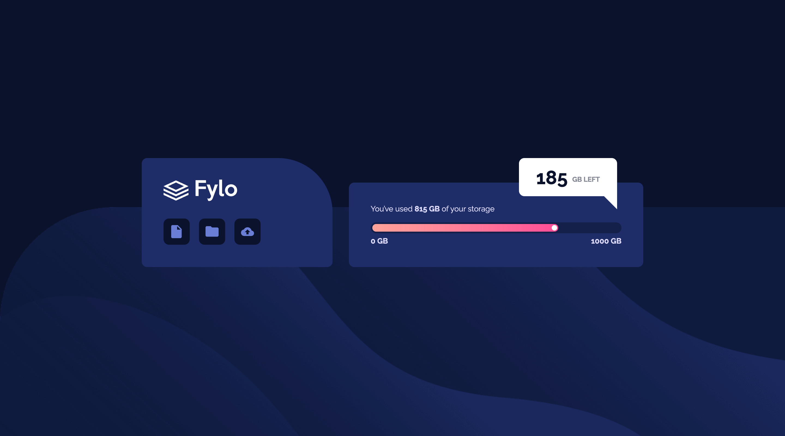

# Frontend Mentor - Fylo data storage component solution

This is a solution to the [Fylo data storage component challenge on Frontend Mentor](https://www.frontendmentor.io/challenges/fylo-data-storage-component-1dZPRbV5n). Frontend Mentor challenges help you improve your coding skills by building realistic projects. 

## Table of contents

- [Frontend Mentor - Fylo data storage component solution](#frontend-mentor---fylo-data-storage-component-solution)
  - [Table of contents](#table-of-contents)
  - [Overview](#overview)
    - [The challenge](#the-challenge)
    - [Screenshot](#screenshot)
      - [Mobile view](#mobile-view)
      - [Desktop view](#desktop-view)
    - [Links](#links)
  - [My process](#my-process)
    - [Built with](#built-with)
    - [What I learned](#what-i-learned)
    - [Continued development](#continued-development)
    - [Useful resources](#useful-resources)
  - [Author](#author)
  - [Acknowledgments](#acknowledgments)

## Overview

### The challenge

Users should be able to:

- View the optimal layout for the site depending on their device's screen size

### Screenshot

#### Mobile view

#### Desktop view

### Links

- Solution URL: [Frontend-Mentor_fylo-data-storage-component-master](https://github.com/VangmanawKairung/Frontend-Mentor_fylo-data-storage-component-master)
- Live Site URL: [Frontend Mentor | Fylo data storage component](https://vangmanawkairung.github.io/Frontend-Mentor_fylo-data-storage-component-master/)

## My process

### Built with

- Semantic HTML5 markup
- CSS Flexbox
- Sass/Scss

### What I learned

- Semantic HTML `<main>` : This element defines the central content of a page, excluding headers, footers, and sidebars, to improve accessibility and SEO.
- CSS properties `vertical-align` : property sets an element’s vertical position relative to its line or surrounding content, typically for inline or table-cell elements.

### Continued development

- Master CSS Grid, Flexbox, and media queries for layouts that adapt to various screen sizes.
- Use meaningful tags to improve accessibility and SEO.
- Explore Sass or LESS for better-organized and reusable styles.
- Implement ARIA roles, alt text, and keyboard navigation for inclusive designs.
- Test and fix styling for consistent display across major browsers.
- Use responsive images and compressed assets for faster load times.

### Useful resources

- [position](https://developer.mozilla.org/en-US/docs/Web/CSS/position) - This site deeply explains the CSS property `position`.

## Author

- Frontend Mentor - [Kairung Vangmanaw](https://www.frontendmentor.io/profile/VangmanawKairung)
- GitHub - [Kairung Vangmanaw](https://github.com/VangmanawKairung)

## Acknowledgments

I would like to express my gratitude to Frontend Mentor for providing engaging challenges that have significantly enhanced my skills. Additionally, I appreciate the resources from MDN Web Docs for their comprehensive documentation, along with the Preview app on Mac for defining element sizes, and using Chrome and VSCode for development. These invaluable tools and resources have played a crucial role in helping me successfully complete this challenge.