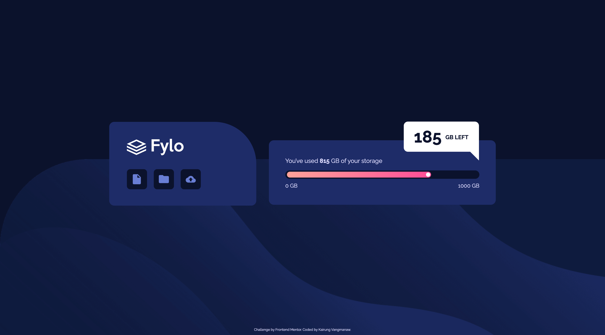
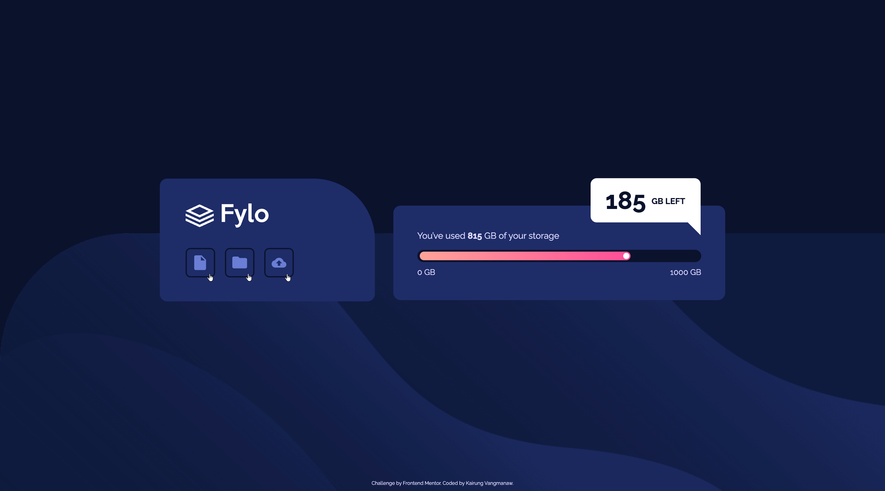

# Frontend Mentor - Fylo data storage component solution


This is a solution to the [Fylo data storage component challenge on Frontend Mentor](https://www.frontendmentor.io/challenges/fylo-data-storage-component-1dZPRbV5n). Frontend Mentor challenges help you improve your coding skills by building realistic projects. 

## Table of contents

- [Frontend Mentor - Fylo data storage component solution](#frontend-mentor---fylo-data-storage-component-solution)
  - [Table of contents](#table-of-contents)
  - [Overview](#overview)
    - [The challenge](#the-challenge)
    - [Screenshot](#screenshot)
    - [Links](#links)
  - [My process](#my-process)
    - [Built with](#built-with)
    - [What I learned](#what-i-learned)
    - [Continued development](#continued-development)
    - [Useful resources](#useful-resources)
    - [AI Collaboration](#ai-collaboration)
  - [Author](#author)
  - [Acknowledgments](#acknowledgments)


## Overview

### The challenge

Users should be able to:

- View the optimal layout for the site depending on their device's screen size

### Screenshot

<details>
  <summary>Mobile view</summary>
  
</details>

<details>
  <summary>Desktop view</summary>
  
</details>

<details>
  <summary>Active state view</summary>
  
</details>

### Links

- Solution URL: [Fylo Data Storage Component using React & BEM](https://www.frontendmentor.io/solutions/fylo-data-storage-component-by-html-and-css-gA8X2qMjKW)
- Live Site URL: [Frontend Mentor | Fylo data storage component](https://challenged-by-frontend-mentor.github.io/fylo-data-storage-component-master/)

## My process

### Built with

- Semantic HTML5 markup  
- CSS custom properties  
- Flexbox  
- Mobile-first workflow  
- BEM (Block Element Modifier) Methodology
- [React](https://react.dev/) - JS library  
- [Vite](https://vite.dev/) - Frontend Tooling

### What I learned

Looking back at my old code, it was quite a mess, but this project marks a huge step forward for me in writing clean and systematic code.

One of my biggest takeaways was deeply understanding how to structure CSS using the BEM methodology. It made styling my components so much more organized. I also learned a lot about handling SVG icons in React. I discovered that to effectively change SVG colors on hover or focus states, using inline SVGs is much better than rendering them through standard `` tags. Lastly, I got a lot more comfortable with CSS absolute positioning and `transform: translate()` to perfectly align the floating storage badge on both mobile and desktop screens.

```css
/* A snippet I'm proud of: Perfectly positioning the floating badge */
.storage-stat__badge {
  position: absolute;
  bottom: 0;
  left: 50%;
  transform: translate(-50%, 50%);
}
```

### Continued development

Moving forward, I want to keep things simple and just focus on writing cleaner, more maintainable code. I plan to continue practicing my CSS architecture (like BEM) so it becomes second nature. I also want to keep improving my web accessibility practices step by step in my future projects.

### Useful resources

- [CSS Triangle - CSS-Tricks](https://css-tricks.com/snippets/css/css-triangle/) - This article was incredibly helpful for figuring out how to create the small triangle pointer on the storage badge using pure CSS.

- [clip-path - MDN Web Docs](https://developer.mozilla.org/en-US/docs/Web/CSS/Reference/Properties/clip-path) - A great documentation page that helped me explore how to create complex shapes.

- [conic-gradient - MDN Web Docs](https://developer.mozilla.org/en-US/docs/Web/CSS/Reference/Values/gradient/conic-gradient) - This helped me understand different techniques for background gradients.

- [Create a Triangle in CSS](https://www.coding-dude.com/wp/css/create-a-triangle/) - Another awesome resource that provided clear, alternative ways to approach CSS shapes.

### AI Collaboration

For this project, I used **Gemini** and **Google Search AI Mode**. I relied on them as my coding assistants to review my CSS architecture, debug hover state issues with my SVGs, and bounce ideas off of to find the best practices for React component structures. It was a great collaborative experience that helped me level up my skills.

## Author

- GitHub: [Kairung Vangmanaw](https://github.com/VangmanawKairung)
- Frontend Mentor - [@VangmanawKairung](https://www.frontendmentor.io/profile/VangmanawKairung)

## Acknowledgments

For this project, I heavily relied on the built-in **Preview app on macOS** to measure exact pixel values from the design images. Even though I used a design overlay technique, knowing the exact measurements upfront helped me work so much faster rather than doing trial and error.

I want to say a huge thank you to **myself** for pushing through the bugs and finishing this challenge, to **my family** for their constant support, to the **Frontend Mentor team** for providing such realistic and engaging challenges, and to all the development tools that made this project a success!